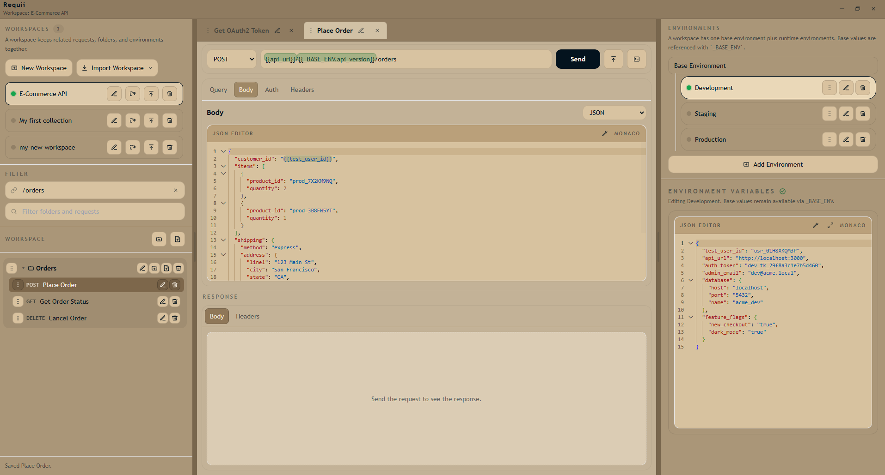

<p align="center">
  
</p>

<h1 align="center">Requii</h1>

<p align="center">
  A free, local-first API client that stores everything as plain files.<br>
  No accounts. No cloud. No telemetry. Just your requests on your disk.
</p>

<p align="center">
  <a href="https://diogojesusdev.github.io/Requii/">Website</a> · 
  <a href="https://github.com/diogojesusdev/Requii/releases/latest">Download</a> · 
  <a href="https://github.com/diogojesusdev/Requii/issues">Report a Bug</a>
</p>

---

## Why Requii?

Most API clients lock your data in proprietary formats, require accounts, or gate features behind paywalls. Requii takes a different approach:

- **File-based workspaces** — Requests, folders, and environments are plain JSON files on disk. Back them up, version them with Git, or move them to another machine by copying a folder.
- **AI & automation friendly** — Because everything is a file, AI coding agents and scripts can read, create, and modify requests directly. No plugins or APIs needed.
- **Copilot skill installer built in** — Install the Requii Copilot CLI skill from inside the app (Windows/macOS) to bootstrap agent terminology and safe request execution workflow.
- **Easy sharing** — Export a workspace (or a selection) as a single JSON file. Share via Slack, email, or commit it to your repo.
- **Flexible environments** — Base environment + per-context overrides (dev, staging, production). Nested variables, cross-references, and interpolation everywhere.
- **Built-in auth** — OAuth2 (authorization code, client credentials, PKCE), Bearer tokens, and Basic auth. Configure once per environment.
- **Smart code editor** — Monaco-powered body editor with syntax highlighting, formatting, and autocomplete for JSON, XML, and more.
- **Cancel in-flight requests** — Abort running requests instantly with one click.
- **Insomnia import** — Migrate existing collections without manual recreation.
- **Cross-platform** — Windows, macOS, and Linux installers.
- **Private & offline** — No internet required, no telemetry, no data leaves your machine.

## Download

| Windows | macOS | Linux |
|---------|-------|-------|
| [.exe installer](https://github.com/diogojesusdev/Requii/releases/latest) | [.dmg](https://github.com/diogojesusdev/Requii/releases/latest) | [.deb](https://github.com/diogojesusdev/Requii/releases/latest) |
| [.msi installer](https://github.com/diogojesusdev/Requii/releases/latest) | [.pkg](https://github.com/diogojesusdev/Requii/releases/latest) | [.rpm](https://github.com/diogojesusdev/Requii/releases/latest) |

Or visit the [Releases page](https://github.com/diogojesusdev/Requii/releases/latest) for all options.

## Screenshots

<p align="center">
  
</p>

## Development

```bash
npm install          # install dependencies
npm run dev          # start dev server + Electron
npm run build        # production build
npm run start        # launch Electron with production build
```

## Building Installers

Requii uses `electron-builder`. Output goes to `release/`.

```bash
npm run dist:win     # Windows: NSIS .exe + .msi
npm run dist:mac     # macOS: .dmg + .pkg
npm run dist:linux   # Linux: .deb + .rpm
```

macOS and Linux builds should run on their native OS or CI runners.

### CI/CD

The repo includes a manually triggered workflow (`.github/workflows/manual-builds.yml`) that builds all platforms on native GitHub-hosted runners and publishes a GitHub Release with the artifacts.

## Workspace Storage

On first launch, Requii creates a workspace in your app data directory. Requests are stored as individual JSON files, environments in `environments.json`. The format is simple and human-readable — you can edit files directly if needed.

## Contributing

Issues and pull requests are welcome. This project is MIT licensed.

## License

[MIT](LICENSE)